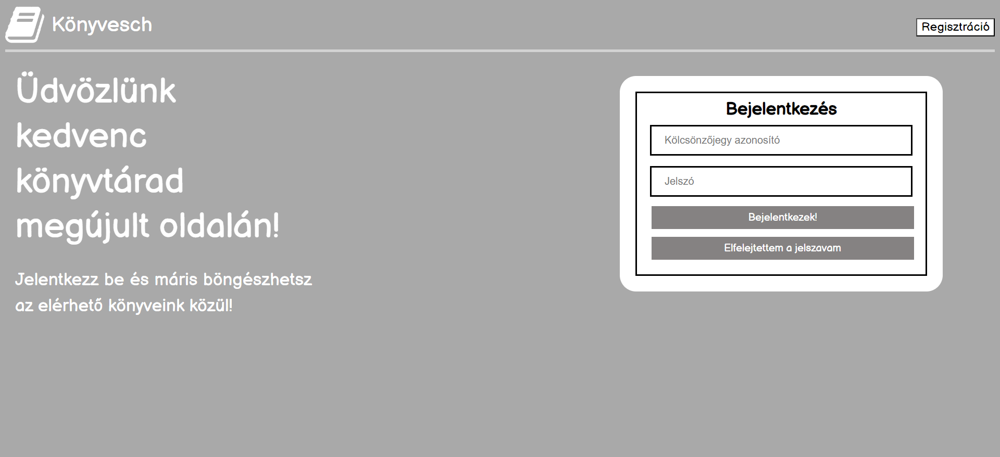
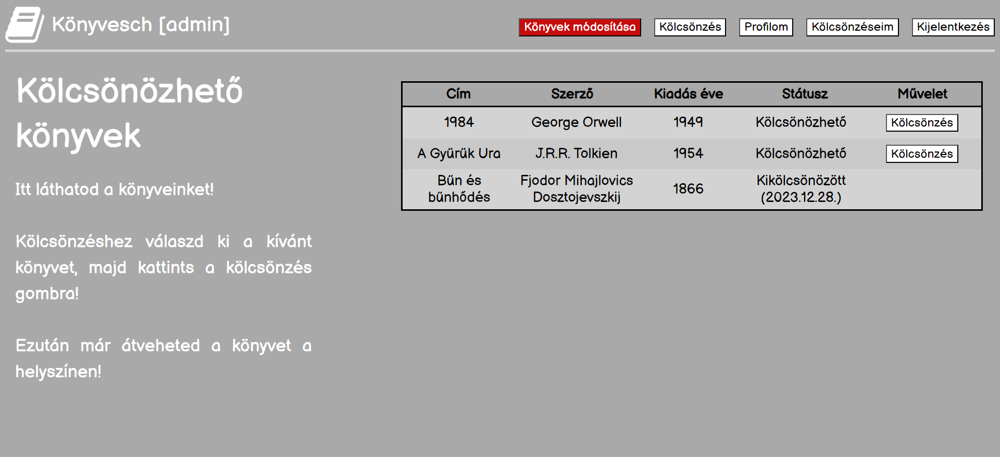

# OnlineLibrary

## Feladat leírása

A Könyvesch könyvtár szeretne készíteni egy webes katalógust az olvasói számára, hogy megkönnyítse a kölcsönzést. Az olvasó regisztrálhat kölcsönzőjegyével, illetve ha már ezt megtette bejelentkezhet, így használhatja a weboldal funkcióit.
Az olvasóról tárolásra kerül a teljes neve, kölcsönzőjegyének azonosítója, e-mail címe és a jelszava. Továbbá lehetősége van megváltoztatni a jelszavát és e-mail címét. Profil törlésre is van lehetőség, azonban ehhez feltétel, hogy ne legyen aktív kölcsönzése.
A könyvekről tároljuk a címét, szerzőjét, kiadás évét és a kölcsönzésének státuszát.
A kölcsönzések során tároljuk, hogy ki és mit kölcsönzött, illetve a kölcsönzés kezdetét és végét.
A felhasználónak lehetősége van megtekinteni az általa kölcsönzött könyveket, az éppen kölcsönözhető könyveket és a profilját amin elvégezheti a megengedett módosításokat, illetve a törlést.

<i>A kölcsönzés és visszavétel alapvetően a helyszínen történik, azonban ez jelen esetben nem megoldható, ezért a lejárati dátum után egyből kölcsönözhetővé válik az adott könyv. Feltételezzük, hogy a könyvtár tagjai megbízhatóak.</i>

## Nézet: Bejelentkezés

A főoldalon a megfelelő adatok beírása után a „Bejelentkezés” gombra kattintva léphetünk be, ekkor a kölcsönzés oldalra kerülünk. Ha még nincs felhasználónk, akkor a jobb felső „Regisztráció” gombbal megtehetjük.

## Nézet: Regisztráció

Ezen az oldalon lehetőségünk van regisztrálni, illetve ha már van felhasználónk, akkor a jobb felső „Bejelentkezés” gombra nyomva átkerülünk bejelentkezési oldalra. Az adatok beírása után a „Regisztrálok” gomb megnyomásával létrejön a fiók és átirányít az új profil kölcsönzés oldalára.

## Nézet: Kölcsönzés

A fenti menüben a „Kölcsönzés” gombra kattintva, illetve belépés után alapértelmezetten erre az oldalra lehet jutni. Itt egy listában megjelennek a könyvtár könyveinek adatai, illetve a státuszaik. A státusz lehet kikölcsönzött és kölcsönözhető. A listában a kiválasztott kölcsönözhető könyv sorának kijelölése után a táblázat alatti gombbal lehet kölcsönözni az aktuális naptól számítva egy hónapra.
A menüsorban látható a „Kijelentkezés” gomb, amelyet ha megnyomunk elindítja a kijelentkezést és visszairányít a regisztrációs főoldalra.

## Nézet: Kölcsönzéseim

A „Kölcsönzéseim” menügomb használata után erre az oldalra kerülünk. Itt láthatjuk egy listában az aktív kölcsönzések adatait és lejárati dátumait.

## Nézet: Profilom

A „Profilom” menügomb megnyomásával tudunk erre az oldalra jutni. A mezőkben láthatjuk a jelenlegi adatainkat és amelyek szerkeszthetőek, azokat tudjuk módosítási célból szerkeszteni és a „Módosítások mentése” gomb megnyomásával jóváhagyni. A „Profil törlése” gomb használata esetén tudjuk törölni a felhasználónkat, ha nincs aktív kölcsönzésünk.

## Nézet: Könyvek módosítása

Az admin joggal rendelkező felhasználók módosíthatják a könyvtár adatbázisát a „Könyvek módosítása” gombra kattintva.